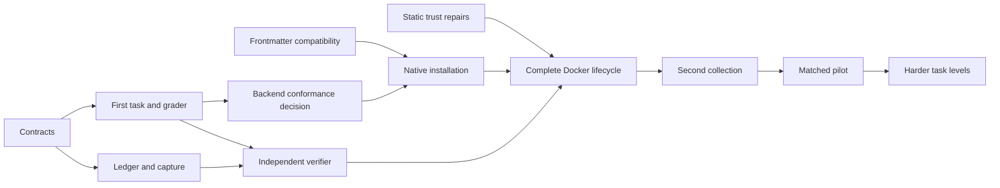

# Plan: trustworthy goal-driven skill evaluations

- Date: 2026-09-20
- Status: planning baseline with scaffolded work; runtime capability not implemented
- Home: skillc; first external subject: Claude Power Pack (CPP)
- Roadmap tracker: [#1](https://github.com/cooneycw/skillc/issues/1)
- This delivery: documentation PR/merge and issues, not implementation or paid trials

## Outcome

Measure whether an agent using a selected scaffold collection achieves a public
goal within its constraints, and whether the scaffold improves results under
matched conditions. Start with a small, trustworthy measurement path. Add harder
task families when its evidence can support them.

The [specification](docs/specs/evaluation-facility/spec.md) owns scope and EF-01
through EF-11 acceptance. The [interface contracts](docs/specs/evaluation-facility/interfaces.md)
own installation, ledger, capture and verified-result boundaries. The
[protocol](docs/specs/evaluation-facility/protocol.md) owns experiment semantics;
[ADR 0002](docs/decisions/0002-independent-goal-driven-evaluation.md) records the
architecture. [Decision tracking](docs/specs/evaluation-facility/review.md) maps
remaining choices to issues. This plan owns order and delivery gates.

## Decisions sufficient to begin

- Keep CPP untouched. Acquire pinned inputs and use disposable workspace/home
  directories; no real consumer install, CPP CI change, deployment or GitHub
  mutation is part of a trial.
- Preserve the standalone stdlib-only static checker. First repair its documented
  trust gaps; a passing existing suite does not cover those gaps.
- Start with CPP's native Codex skill surface and one client. Record exact selected
  skills, helpers and configuration before comparing with a clean baseline. This
  is an installed-surface study, not a claim to test all CPP clients or workflows.
- Use the existing CPP small-fix/slug pilot as the Level 1 fixture seed, pinned
  independently from the subject. It is a measurement canary with possible ceiling
  effects; a null result is valid. Do not inherit its historical confounded prompts.
- Evaluate Coder Eval first as a replaceable backend, using the
  [pinned static inspection](docs/research/coder-eval-skillc-contract-handoff-2026-09-20.md).
  Backend adoption requires conformance evidence. The inspected Codex full-access
  path must remain inside the isolated Docker lane.
- Own four contracts in skillc: installation receipt, controller trial ledger,
  immutable artifact/observation capture, and independently verified results.
  A valid JSON record, hash or echoed config alone does not authenticate success.
- Defer model/version, precise spending limits and repeats until the pilot manifest.
  Defer qualification thresholds until actual observations support calibration.

## Issue order and dependencies

P0 establishes trust and makes the first implementation concrete. P1 delivers one
end-to-end measurement capability. P2 grows difficulty after reviewing that evidence.
Dependencies are completion gates; research/design can proceed together where
inputs are independent. Do not run paid trials merely because their issue exists.

| Issue | Priority | Deliverable | Depends on |
|---|---|---|---|
| [#2](https://github.com/cooneycw/skillc/issues/2) | P0 | Prevent false certification in selftest and unknown rule selection | Planning baseline |
| [#3](https://github.com/cooneycw/skillc/issues/3) | P0 | Make frontmatter types and supported syntax explicit | Planning baseline |
| [#4](https://github.com/cooneycw/skillc/issues/4) | P0 | Version the installation, ledger, artifact and verified-result contracts | Planning baseline |
| [#5](https://github.com/cooneycw/skillc/issues/5) | P0 | Establish the first Level 1 goal and prove its grader | [#4](https://github.com/cooneycw/skillc/issues/4) |
| [#6](https://github.com/cooneycw/skillc/issues/6) | P0 | Qualify Coder Eval as a replaceable backend with bounded conformance probes | [#4](https://github.com/cooneycw/skillc/issues/4), [#5](https://github.com/cooneycw/skillc/issues/5) |
| [#7](https://github.com/cooneycw/skillc/issues/7) | P1 | Materialize CPP natively and prove a clean comparison baseline | [#3](https://github.com/cooneycw/skillc/issues/3), [#4](https://github.com/cooneycw/skillc/issues/4), [#6](https://github.com/cooneycw/skillc/issues/6) |
| [#8](https://github.com/cooneycw/skillc/issues/8) | P1 | Implement controller-owned trial accounting and artifact capture | [#4](https://github.com/cooneycw/skillc/issues/4) |
| [#9](https://github.com/cooneycw/skillc/issues/9) | P1 | Implement independent grading and adversarial evaluator controls | [#5](https://github.com/cooneycw/skillc/issues/5), [#8](https://github.com/cooneycw/skillc/issues/8) |
| [#10](https://github.com/cooneycw/skillc/issues/10) | P1 | Demonstrate the complete Docker trial lifecycle without a paid model | [#2](https://github.com/cooneycw/skillc/issues/2), [#6](https://github.com/cooneycw/skillc/issues/6), [#7](https://github.com/cooneycw/skillc/issues/7), [#8](https://github.com/cooneycw/skillc/issues/8), [#9](https://github.com/cooneycw/skillc/issues/9) |
| [#11](https://github.com/cooneycw/skillc/issues/11) | P1 | Prove the same interfaces with a second independent skill collection | [#10](https://github.com/cooneycw/skillc/issues/10) |
| [#12](https://github.com/cooneycw/skillc/issues/12) | P1 | Predeclare and run the first bounded matched pilot with an evidence report | [#11](https://github.com/cooneycw/skillc/issues/11) |
| [#13](https://github.com/cooneycw/skillc/issues/13) | P2 | Extend calibrated task families to constraints and integration | [#12](https://github.com/cooneycw/skillc/issues/12) |
| [#14](https://github.com/cooneycw/skillc/issues/14) | P2 | Add workflow-judgment and resilience evaluations | [#13](https://github.com/cooneycw/skillc/issues/13) |
| [#15](https://github.com/cooneycw/skillc/issues/15) | P2 | Calibrate adaptive tasks and define evidence-backed level qualification | [#14](https://github.com/cooneycw/skillc/issues/14) |

The critical sequence is contracts -> first grader -> backend decision -> native
installation -> complete lifecycle -> second collection -> matched pilot. Static
repairs and controller capture can proceed alongside the relevant design work.
Independent verification joins the complete-lifecycle gate before live comparisons.

## Delivery gates and evidence

### A. Repair trust and define the experiment

[#2](https://github.com/cooneycw/skillc/issues/2), [#3](https://github.com/cooneycw/skillc/issues/3), [#4](https://github.com/cooneycw/skillc/issues/4) and [#5](https://github.com/cooneycw/skillc/issues/5) establish
rule identity, nonempty controls, required types, scoped compatibility and the
first independently checkable goal. Baseline static checks currently pass: six
rule controls, 12 tests, lint and type checks. The historical assessment documents
counterexamples outside that suite; those issues must add discriminating coverage.

Exit: healthy controls pass, broken controls cannot certify, and the first grader
accepts valid alternative solutions while rejecting plausible wrong outputs.
Maps to EF-03, EF-04, EF-05 and EF-11. No live model is needed.

### B. Qualify the backend and enforce owned evidence

[#6](https://github.com/cooneycw/skillc/issues/6) is bounded: inspect one pinned candidate, demonstrate one small
control-driven path, then adopt/wrap/reject with reasons. Investigate alternatives
only for named unmet requirements. Coder Eval's execute/grade separation is a
candidate seam, not a verified protected grading boundary.

[#7](https://github.com/cooneycw/skillc/issues/7), [#8](https://github.com/cooneycw/skillc/issues/8) and [#9](https://github.com/cooneycw/skillc/issues/9) deliver native receipts,
complete trial accounting, protected capture and independent verdicts.
[#10](https://github.com/cooneycw/skillc/issues/10) demonstrates their join with a deterministic client before
paid agent execution. Replay forged/stale success and broken-grader controls
through the actual integration, including candidate attempts to forge verifier output.

Exit: an inspectable trial bundle survives success, task failure, interruption,
unavailability and evidence loss. Cleanup preserves original repositories and
host state. Maps to EF-02 through EF-08, EF-10 and EF-11.

### C. Prove generic selection and report a real comparison

[#11](https://github.com/cooneycw/skillc/issues/11) exercises the same interfaces with a second tiny independent
collection; CPP plus an empty baseline is insufficient. It proves EF-01 for a
bounded support matrix, not universal project compatibility.

[#12](https://github.com/cooneycw/skillc/issues/12) first produces a concrete experiment manifest with exact identities,
public acceptance, arm definitions, repeats, ordering, interactions, retention and
per-trial/total time and monetary limits. A paid run requires an approved budget;
without one, report the manifest as prepared and execution as incomplete.

Exit: all attempts appear in an exploratory evidence report, including failures,
unknowns, retries and non-starts. Separate outcome, completion-claim accuracy,
interventions, availability, time and observed cost. Do not convert missing cost
to zero or faster failures into efficient delivery. Maps to EF-06 and EF-07;
EF-09 prevents unsupported qualification from this small pilot.

### D. Extend difficulty from observed results

[#13](https://github.com/cooneycw/skillc/issues/13) adds constraint handling and real consuming-path integration,
varying task demands one dimension at a time. [#14](https://github.com/cooneycw/skillc/issues/14) adds workflow
judgment, then interruption and coordination as separate task families.
[#15](https://github.com/cooneycw/skillc/issues/15) adds unfamiliar/ambiguous work and establishes qualification
criteria from pilot distributions. Refine these planning issues into bounded
implementation tasks when their prerequisite evidence exists.

Every new authoritative check needs controls. Version task placement and evidence
standards; do not silently change them after observing a subject's score. Levels
classify task demands, not unit/integration/end-to-end testing layers. Qualification
cannot average away mandatory easier-task failures. Maps primarily to EF-09.

## Completion and limits

The first useful facility satisfies EF-01 through EF-08, EF-10 and EF-11 for its
stated support matrix. EF-09's reporting limits apply immediately; statistical
qualification comes later. A null or negative scaffold result can complete a valid
experiment. Facility delivery and subject performance are separate measures.

This plan introduces no runner, paid experiment, leaderboard or automatic subject
rating. Historical reports are retained as dated research; they are not claims
about the current CPP revision or a reproduced live Coder Eval trial.
