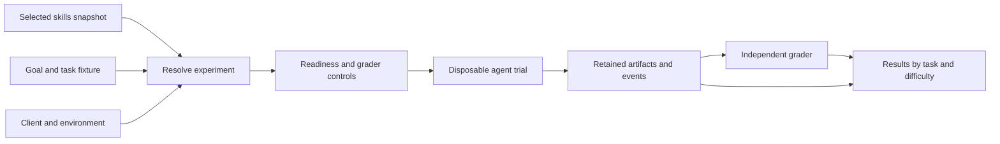

# Specification: goal-driven evaluation of scaffolding skills

- Status: Planning baseline; implementation tracked in PLAN.md
- Date: 2026-09-20
- Home: skillc
- Architecture proposal: [ADR 0002](../../decisions/0002-independent-goal-driven-evaluation.md)
- Companion: [Evaluation protocol](protocol.md)
- Interfaces: [Integration, reporting and verification](interfaces.md)
- Open decisions: [Design review](review.md)
- Delivery sequence: [PLAN.md](../../../PLAN.md)

## 1. Objective

Evaluate how reliably an agent using a selected collection of scaffolding skills
achieves a goal, and whether that collection improves outcomes compared with a
minimal baseline or another revision. Organize tasks into progressively harder
levels and retain evidence sufficient to inspect every result.

The subject is the tested configuration: skill collection, client, model,
environment and budget. The facility does not assign an intrinsic intelligence
score to a collection of Markdown files.

CPP is the first intended subject, not a runtime dependency of the evaluator.
Another accessible project should be selectable through a supported subject
adapter without adding project-specific branches to the runner or grader.

## 2. Status and document ownership

The owner has authorized planning, a documentation PR/merge and issue scaffolding.
Runtime implementation and paid trials are outside this change. These
documents specify proposed behavior; they do not claim any evaluation facility
exists. The existing static checker remains the only implemented product surface.

This document owns product scope, capability levels and functional acceptance.
The protocol owns result semantics and experiment rules. The interface document
owns adapter obligations, evidence ownership and conformance. The ADR records the
architectural choice and alternatives. PLAN.md sequences delivery; it does not
restate the requirements. Review questions identify decisions still needed.

The owner's instructions take precedence. Within this draft set, an inconsistency
is a document defect to resolve, not permission to pick the less demanding rule.

## 3. User workflows

1. Select an accessible skills project, revision and supported installation mode.
2. Select a goal-based task or task family at a stated difficulty level.
3. Select a compatible client/model, environment and budget.
4. Inspect the resolved subjects, comparison arms, planned trials and expected cost
   bounds before starting any paid run.
5. Run trials in disposable environments and grade independently.
6. Inspect results by level, task, subject and failure cause, including incomplete
   trials and retained evidence.

The same goal may be run with a whole workflow pack or one selected skill. Those
are different treatments and must be named as such. A suite supporting one
client or installation mode must not imply compatibility with all clients.

## 4. Scope and boundaries

### Required in the initial design

- Read-only acquisition of an explicitly selected repository revision or local snapshot.
- Explicit subject, client, environment, task and grader contracts.
- Goal-based cases, difficulty levels and independently controlled graders.
- One isolated Docker execution lane and one verified client adapter initially.
- Matched comparisons and retained per-trial results, including failures.
- A report generated from evidence artifacts; no hosted service is required.

### Excluded from the first implementation

- Changes to CPP or another subject's working checkout, branches, host install or CI.
- Automatic execution of arbitrary discovered repository setup instructions.
- Real deployments, issue creation, PR merging or infrastructure changes during trials.
- A fleet scheduler, universal agent platform, public leaderboard or benchmark badge.
- Support for every client, operating system or skill format without a tested adapter.
- A claim that equal results on a small sample prove a skill has no value.

The static compiler retains its independent CLI and zero runtime dependencies.
The stdlib-only rule in AGENTS.md remains binding for `skillc/`. Optional execution
dependencies require a separate boundary or a reviewed change to that constraint.

## 5. Concepts and proposed interfaces

These are semantic contracts. File formats and command syntax are not selected.
[Interface contracts](interfaces.md) define required records, operations and controls.

| Entity | Required meaning |
|---|---|
| Subject | Source locator, immutable revision/content identity, selected skill surface, adapter and declared capability scope |
| Subject adapter | Supported format, install/materialization recipe, compatibility requirements and observable readiness checks |
| Client adapter | Native agent invocation, instruction-loading route, version/configuration, event collection and stopping behavior |
| Environment profile | Immutable environment identity, available tools, workspace layout, network/resource policy and authority boundary |
| Task | Goal, fixture identity, constraints, allowed interaction, expected outcomes, difficulty and applicable capability scope |
| Grader | Independently versioned outcome checks/rubric and known-good/bad controls |
| Experiment | Subjects/arms, task population, fixed configuration, repeat schedule, budget and comparison hypothesis |
| Trial | One scheduled attempt with an immutable ID, observed events, artifacts and classified result |
| Report | Derived counts, comparisons, uncertainty and links back to the relevant trials |

Proposed data flow:

### Subject acquisition

Resolve branch/tag inputs to immutable identities before running. For an explicit
local working-tree snapshot, record content identity and its difference from the
committed tree; never label dirty bytes as an unchanged commit. Exclude credentials
and unrelated host files. Unreadable or unsupported inputs are named explicitly.

Discovery reports what was found and how. It does not infer a reliable skill's
purpose, compatible client or installer merely from a directory name. An adapter
may use existing conventions, but its install recipe and resulting surface must
be observable and confined to the trial environment.

Keep four observations distinct: files discovered, skill installed/available,
skill actually invoked, and task outcome. Evidence of one does not establish the
others. Invocation is graded only when it is an explicit case requirement.

### Task applicability

Select eligible tasks before results are known. Common benchmarks compare
subjects on the same eligible population; capability-specific suites test what
a subject actually promises. A documentation skill need not qualify for worker
coordination to be useful. Reports list exclusions and their reasons.

An unexpected incompatibility after selection remains a visible failed or
unavailable attempt under the protocol; it must not quietly disappear from the
denominator. Ordinary project requirements are shared by both comparison arms.
Only the scaffolding treatment being studied differs.

## 6. Progressive difficulty

Levels classify demands on the agent, not testing techniques or environment types.

| Level | Capability | Illustrative task | Main evidence |
|---|---|---|---|
| 1 - Basic execution | Complete one clear, bounded job | Fix a function or add a small importer | Held-out acceptance passes and existing behavior survives |
| 2 - Constraint handling | Meet several requirements within explicit boundaries | Handle invalid rows without changing a public interface or adding dependencies | Functional and constraint checks both pass |
| 3 - Integration | Make connected components work together | Connect a helper, CLI and persistence layer | The installed consuming path works, not only isolated functions |
| 4 - Workflow judgment | Manage intent, authority and completion evidence | Execute approved work, review new files and account for revised acceptance | Observed actions and final state justify the completion report |
| 5 - Resilient coordination | Preserve correctness through interruption or shared work | Resume safely or reconcile workers' overlapping changes | Work survives, required actions are not duplicated and missing evidence stays visible |
| 6 - Adaptive delivery | Handle unfamiliar and under-specified problems | Diagnose a new repository and challenge an unsuitable proposed approach | Outcome and constraints survive, with justified clarification and tradeoffs |

Task families may share an underlying goal while varying one difficulty dimension
at a time. Levels are initially hypotheses; pilot results must calibrate them.
Neither file count nor prompt length establishes difficulty. Changes in task
placement are versioned, not silently applied after scoring.

An evaluator may supply scripted user answers or approvals when the task contract
defines them. Seeking necessary clarification can be correct behavior. Higher
difficulty grants no additional real-world authority. Recovery and multiworker
coordination begin as separate Level 5 families before combined stress cases.

### First task family

Start with CPP's existing small-fix delivery pilot: repair a slug function against
public behavior requirements and held-out variations. Pin the fixture separately
from the subject revision, preserve provenance and audit its old prompt arms for
confounding differences. This is a measurement canary with possible ceiling effects,
not a strong demonstration of broad CPP benefit. The first-task issue finalizes
its public contract, independent reference outcomes and grader controls.

Later variants add constraints and a real consuming path. Workflow judgment and
resilience use separate task families where needed. Public requirements describe
all required behavior; held-out inputs introduce no secret requirements. Valid
alternative implementations satisfying the contract must pass.

## 7. Isolation and grading authority

The evaluator controls preparation, evidence capture and grading outside the
agent's writable workspace. Subjects execute only against disposable copies.
Original repositories and host installation roots are not writable by trials.

Authoritative tests, results and grader configuration cannot be replaced by the
agent. A separate grader receives a defined artifact export and authentic event
records; it must not blindly trust an agent-created success file. Where solution
code must run during grading, isolate that execution too.

Docker is the initial repeatability mechanism, not proof of all host semantics.
Use a disposable VM or separately reviewed environment profile for claims about
host namespaces, mounts, sessions or capabilities Docker does not represent.
Do not expose a writable Docker socket to the agent.

Required external services and narrow credentials are explicit run inputs.
Provision access without storing secret values in evidence. Paid trials and
concurrency require declared limits; missing credentials never become a pass.

## 8. Acceptance map

Every future load-bearing rule needs discriminating evidence. These are proposed
acceptance pairs, not tests that have been written or run.

| ID | Requirement | Good and bad evidence |
|---|---|---|
| EF-01 | Generic subject selection | CPP and a second minimal collection use the same runner/grader; unsupported format is named rather than guessed |
| EF-02 | Immutable, nondisturbing inputs | Source/host state remains unchanged after success and failed setup; unresolved revision or escaped input path is rejected |
| EF-03 | Real install readiness | An installed executable surface is observed; empty discovery or success with missing required files refuses readiness |
| EF-04 | Goal-based acceptance | Correct solutions pass independent checks; a planted semantic defect and a false completion claim fail the relevant checks |
| EF-05 | Controlled grading | Good/bad controls discriminate; a blinded grader or missing result cannot publish a passing trial |
| EF-06 | Matched comparison | Arms share the declared task/configuration; an unintended model, budget or fixture difference prevents a like-for-like claim |
| EF-07 | Complete accounting | All planned attempts have results/reasons; empty selection, timeout, unavailable provider and capture failure stay distinguishable |
| EF-08 | Protected evidence | Editing workspace tests/result files cannot change authoritative grading; records remain linked to their original inputs |
| EF-09 | Progressive qualification | Level claims cite the task population and required evidence; one hard success cannot hide mandatory failures at earlier levels |
| EF-10 | Bounded lifecycle | Timeout/cancellation stops owned processes, retains partial evidence and cleans only owned temporary resources |
| EF-11 | Optional execution layer | Static commands still run without Docker/model access; unavailable eval dependencies affect only eval capability |

Genericity is proved before claiming arbitrary-project support. The second
minimal collection is a small compatibility specimen, not an expansion into a
large second benchmark. A no-scaffolding baseline alone does not prove EF-01.

## 9. Evidence limits and completion

The first milestone establishes a working measurement path, not broad benefit or
a public difficulty qualification. Report implementation delivery separately
from experiment results. An experiment finding no improvement is valid evidence;
engineering progress must not require manufacturing a favorable result.

The initial facility is reviewable when EF-01 through EF-08, EF-10 and EF-11 are
demonstrated for its stated support matrix. EF-09's reporting boundaries apply
from the start; statistical qualification remains deferred until calibration.

Outstanding design choices and their blocking scope are in [review.md](review.md).
